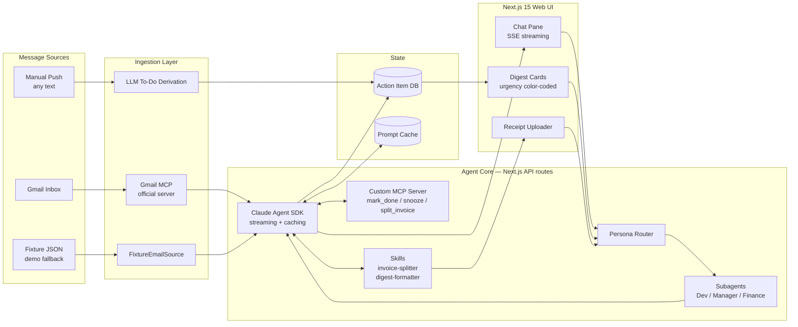
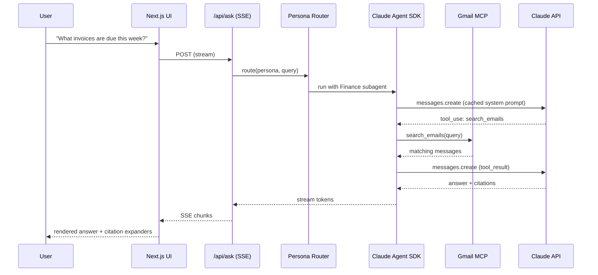
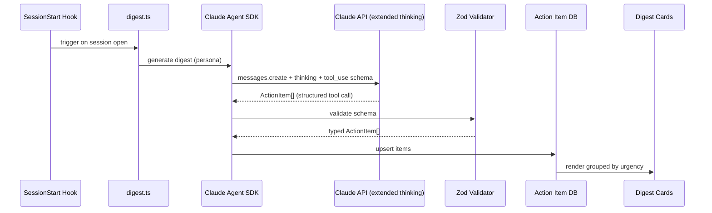
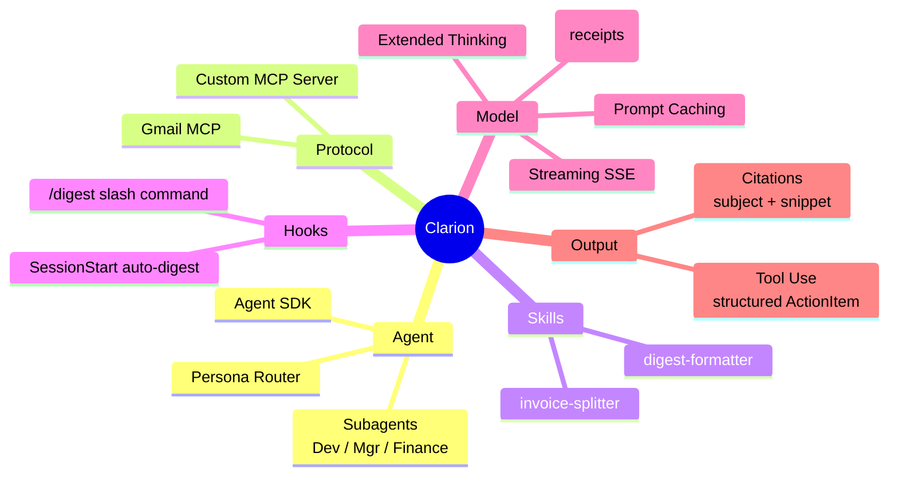

# Clarion — Architecture

> An AI chief-of-staff that reads your messages across channels and turns them
> into a single prioritized action-item briefing. Built for **Push to Prod —
> Singapore**.

---

## 1. What We Built

**Two user-facing features, one engine underneath:**

1. **Chat with your mailbox** — natural-language Q&A over inbox content, every
   answer cited back to the source email.
2. **Daily action-item digest** — bills, expiring items, unreplied threads,
   deadlines — surfaced proactively, prioritized per persona
   (Developer / Manager / Finance).

Plus a **bill-splitter** stretch skill: upload a receipt photo, get a
per-person split via Claude vision.

---

## 2. High-Level Architecture



**Key insight — channel-agnostic by design.** All sources funnel into one
`ActionItem` database. Email is the launch connector; Teams / Slack land via
the manual-push path today and native connectors tomorrow. Adding a channel is
an adapter, not a rewrite.

---

## 3. Request Flow — Chat



---

## 4. Request Flow — Daily Digest



---

## 5. Tech Stack

### Frontend
| Layer | Choice |
|---|---|
| Framework | **Next.js 15** (App Router) |
| Language | **TypeScript** |
| Styling | **Tailwind v4** |
| Streaming UI | **Vercel AI SDK** (`ai`, `@ai-sdk/anthropic`) |
| Markdown | `react-markdown` + `remark-gfm` |
| Deploy | **Vercel** |

### Agent / Backend
| Layer | Choice |
|---|---|
| Agent loop | **Claude Agent SDK** |
| Model SDK | **Anthropic SDK** (`@anthropic-ai/sdk`) |
| Models | **Claude Opus 4.7** (reasoning) / **Sonnet 4.6** (chat) / **Haiku 4.5** (fast paths) |
| Protocol | **MCP** (`@modelcontextprotocol/sdk`) |
| Schema validation | **Zod v4** |
| Runtime | **Node.js** on Vercel edge/serverless |

### Integrations
| Source | Method |
|---|---|
| Gmail | Official **Gmail MCP server** via OAuth |
| Custom tools | **Custom Node MCP server** (`mark_done`, `snooze`, `split_invoice`) |
| Fixtures | `FixtureEmailSource` (JSON, demo fallback) |
| Auth | `google-auth` + `google-auth-oauthlib` (Python-side setup) |

---

## 6. Claude Feature Map — 13 in One Project



| # | Feature | Where |
|---|---|---|
| 1 | Claude Agent SDK | `backend/agent.ts` |
| 2 | MCP — Gmail | `email/sources/gmail-mcp.ts` |
| 3 | MCP — Custom | `mcp-servers/secretary/` |
| 4 | Subagents | `backend/subagents/` |
| 5 | Skills | `.claude/skills/{invoice-splitter,digest-formatter}/` |
| 6 | Hooks | `.claude/settings.json` (SessionStart) |
| 7 | Prompt Caching | system prompt + email index |
| 8 | Extended Thinking | `backend/digest.ts` |
| 9 | Tool Use + Structured Output | `ActionItem` Zod schema |
| 10 | Citations | every chat answer |
| 11 | Vision | invoice splitter |
| 12 | Streaming | `/api/ask` SSE |
| 13 | Slash Commands | `.claude/commands/digest.md` |

---

## 7. Repo Layout

```
backend/        Agent core, digest, prompts, subagents
email/          EmailSource interface, Gmail MCP, fixtures
frontend/       React components, hooks, stub data
app/            Next.js pages + API routes (thin delegators)
mcp-servers/    Custom secretary MCP server
lib/            Shared utilities
.claude/        Skills, hooks, slash commands
docs/           Plan, execution, this diagram
```

Cross-folder imports go through TS path aliases — `@backend/*`,
`@email/*`, `@frontend/*` — so owners can work without stepping on each other.

---

## 8. Why This Architecture Wins

- **Channel-agnostic.** One `ActionItem` schema, many adapters. Email ships
  today; Teams / Slack drop in as adapters.
- **Persona as skill composition.** Same agent, different subagent + skill
  loadout = radically different output. One secretary, many roles.
- **Graceful fallback.** Fixture source means the demo works offline and
  Gmail OAuth is not on the critical path for judges.
- **Every Claude capability, composed.** 13 platform features wired into a
  single coherent product — not a feature checklist, a working system.
